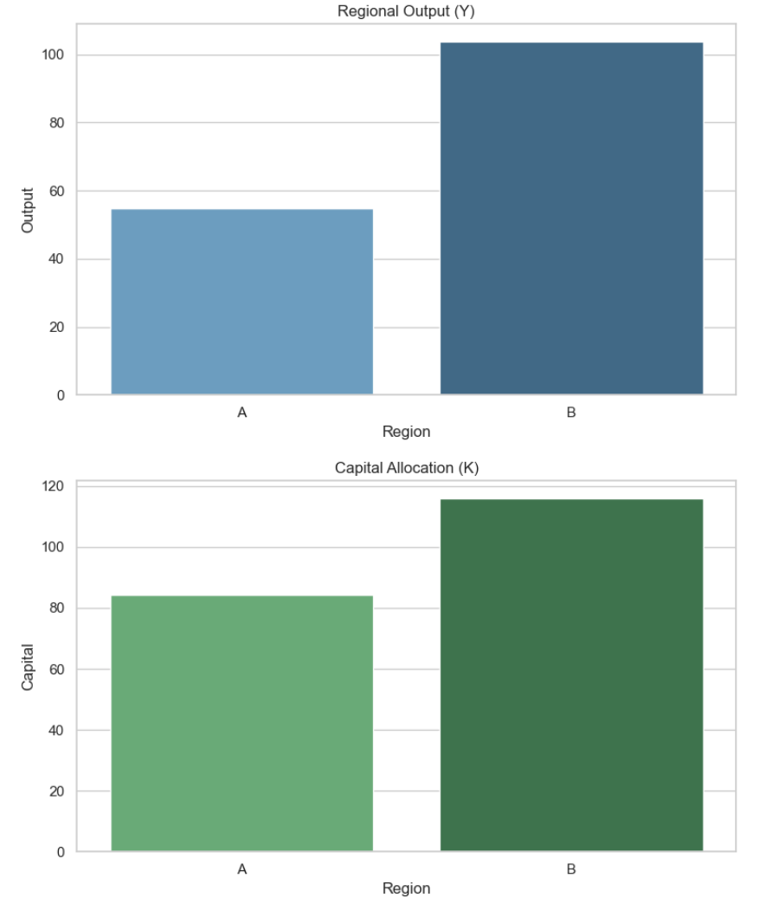

# Simple Spatial CGE Model with GAMSPy

This project demonstrates a basic Spatial Computable General Equilibrium (SCGE) model using [GAMSPy](https://gamspy.readthedocs.io/). It simulates two regions connected through trade with inter-regional capital mobility and transport costs.

## Features
- Two-region SCGE framework
- CES utility, Cobb-Douglas production
- Capital allocation optimization
- Policy simulation: trade cost reduction

## Run
```bash
python main.py
```

